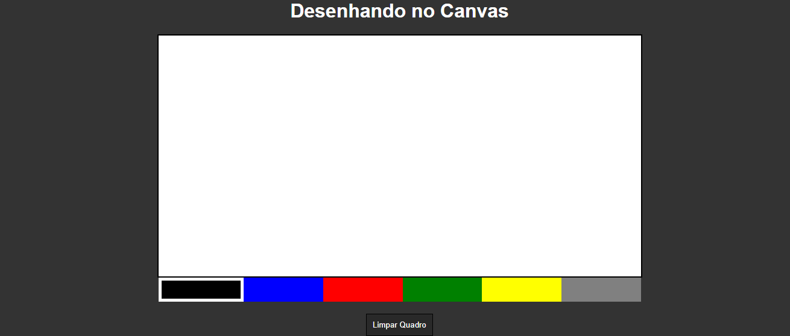

# Quadro-de-desenho
> site para o estudo de javaScript 

Projeto construído como exercício do curso da B7web
> Finalizado

[Clique aqui para acessar](https://rafael-damasceno.github.io/Quadro-de-desenho/)

## Tecnologias:

- HTML
- CSS
- Git e Github
- javaScript

## Aprendido:

- Canvas 
